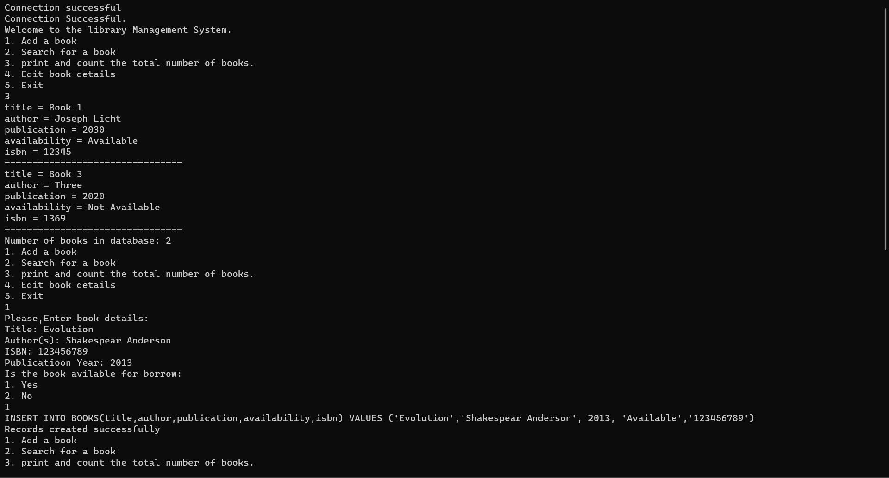
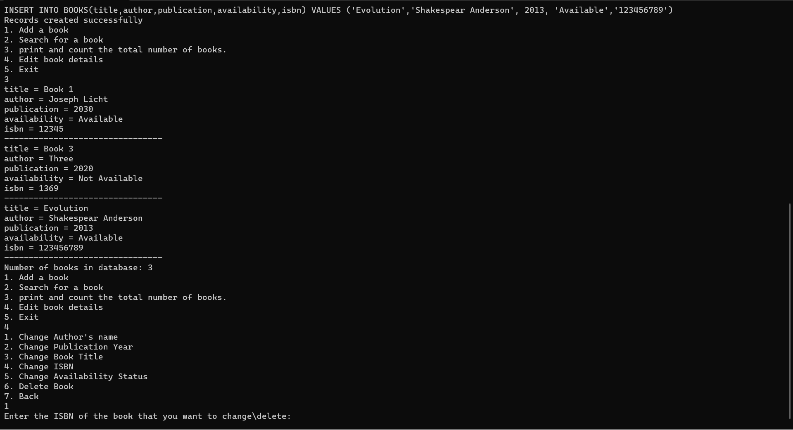
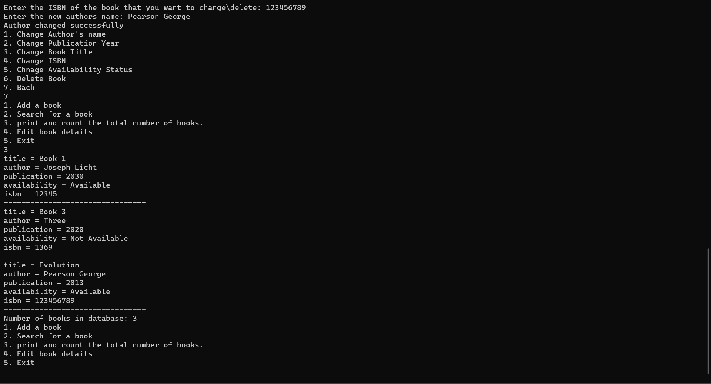

# Library Management System with SQLite database
This project allows users to add books to the add,delete,edit,and search for books  in a database.The program uses classes to store the details of the books before it  is moved to the database. Users can also check for books that are available for borrowing. 

